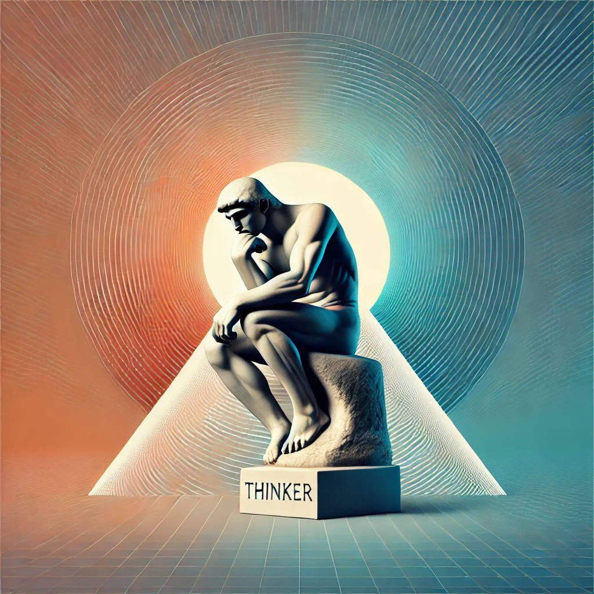

# Multimodal AI Chatbot with Flask and Mistral-Nemo 

This repository contains a GPU-accelerated, multimodal AI chatbot built with Flask, integrating powerful open-source models like Mistral-Nemo-Instruct, Whisper, and BLIP.

## 🔍 Project Overview

This project demonstrates a real-time chatbot that supports text, audio, video, and image inputs. The AI assistant responds with context-aware answers, streaming output to the browser using Server-Sent Events (SSE).

### Core Technologies

- **Flask** (web server)
- **Hugging Face Transformers**
  - Mistral-Nemo-Instruct-2407 (LLM)
  - BLIP-Image-Captioning-Large
  - Whisper-Large-v3-Turbo (ASR)
- **PyTorch**, **CUDA**, **BitsAndBytes** (for efficient inference)
- **HTML/CSS/JS** front-end with live interaction

## ⚙️ Features

- 💬 Streamed chatbot responses from LLM
- 🖼️ Image captioning via BLIP
- 🎙️ Audio/Video transcription with Whisper
- 📦 VRAM management and GPU clearing
- 🔄 Chat, media, and state clearing endpoints
- 🔐 Secure and modular architecture

## 🗂️ Project Structure

```
.
├── LMM_BMW_LC_FLSK__app_chat_temp_v7.py # Main Flask app
├── index_stream.html # Front-end template
├── requirements_venv.txt # Full environment dependencies
├── static/
│ └── thinker.jpg # Background image
└── templates/
└── index_stream.html # HTML interface
```

## Getting Started

### Prerequisites

- Python 3.10
- CUDA 12.1+ compatible GPU with ≥ 24GB VRAM
- Linux or WSL2 for Windows users

### Installation

```bash
git clone https://github.com/PJEDeveloper/Flask_Large_LMM_Chatbot.git
cd Flask_Large_LMM_Chatbot
python -m venv lmm_env
source lmm_env/bin/activate
pip install -r requirements_venv.txt
```

### Run the App

```bash
python LMM_BMW_LC_FLSK__app_chat_temp_v7.py
# Access via http://localhost:5007
```

## Model Notes

- The chatbot uses **Mistral-Nemo-Instruct-2407** for all NLP tasks.
- **BLIP** generates image descriptions used as context.
- **Whisper** processes audio/video into transcriptions for LLM input.

## API Endpoints

| Endpoint             | Method | Purpose                           |
|----------------------|--------|-----------------------------------|
| `/`                  | GET    | Serve UI                          |
| `/stream`            | POST   | Stream model response             |
| `/clear`             | POST   | Reset conversation and VRAM       |
| `/clear_text`        | POST   | Clear input text only             |
| `/clear_audio_video` | POST   | Remove uploaded audio/video       |
| `/clear_image`       | POST   | Remove uploaded image             |
| `/clear_media`       | POST   | Reset processed captions/transcripts |

## 🧹 GPU Memory Management

Run this before restarting the app:
```bash
nvidia-smi
kill -9 <pid>
```

## Screenshots

(Add a screenshot or animated GIF here to showcase the UI and functionality)

## Multimodal AI Chatbot with Flask and Mistral-Nemo License

Apache 2.0 License

# Model Attribution & Licenses
This application incorporates the following pre-trained models:

Mistral-Nemo-Instruct-2407
License: Apache 2.0

Salesforce BLIP Image Captioning (Large)
License: BSD 3-Clause License

Copyright (c) 2025, Patrick Hill

Redistribution and use in source and binary forms, with or without modification, are permitted provided that the following conditions are met:

Redistributions of source code must retain the above copyright notice, this list of conditions and the following disclaimer.

Redistributions in binary form must reproduce the above copyright notice, this list of conditions and the following disclaimer in the documentation and/or other materials provided with the distribution.

Neither the name of the copyright holder nor the names of its contributors may be used to endorse or promote products derived from this software without specific prior written permission.

THIS SOFTWARE IS PROVIDED BY THE COPYRIGHT HOLDERS AND CONTRIBUTORS "AS IS" AND ANY EXPRESS OR IMPLIED WARRANTIES, INCLUDING, BUT NOT LIMITED TO, THE IMPLIED WARRANTIES OF MERCHANTABILITY AND FITNESS FOR A PARTICULAR PURPOSE ARE DISCLAIMED. IN NO EVENT SHALL THE COPYRIGHT HOLDER OR CONTRIBUTORS BE LIABLE FOR ANY DIRECT, INDIRECT, INCIDENTAL, SPECIAL, EXEMPLARY, OR CONSEQUENTIAL DAMAGES (INCLUDING, BUT NOT LIMITED TO, PROCUREMENT OF SUBSTITUTE GOODS OR SERVICES; LOSS OF USE, DATA, OR PROFITS; OR BUSINESS INTERRUPTION) HOWEVER CAUSED AND ON ANY THEORY OF LIABILITY, WHETHER IN CONTRACT, STRICT LIABILITY, OR TORT (INCLUDING NEGLIGENCE OR OTHERWISE) ARISING IN ANY WAY OUT OF THE USE OF THIS SOFTWARE, EVEN IF ADVISED OF THE POSSIBILITY OF SUCH DAMAGE.

OpenAI Whisper Large v3
License: Apache 2.0

---

> Built by Patrick Hill — Veteran, Software Engineer, and AI Developer. For more, visit [linkedin.com/in/hillpje]([https://www.linkedin.com/in/hillpje](https://www.linkedin.com/in/patrick-hill-4b9807178/)


