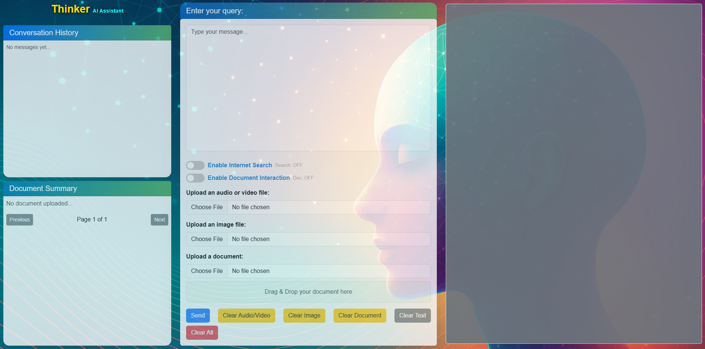

# Mistral_Flask_Chatbot (Thinker)

A production-ready Flask web app that wraps a local **Mistral** LLM with optional **BLIP** (image captioning), **Whisper** (speech-to-text), simple **Google search** enrichment, and lightweight **document QA**. It provides a clean Bootstrap UI, streaming-like synchronous replies, and GPU-memory hygiene between requests.

> **Models**:  
> - Text: `mistralai/Mistral-Nemo-Instruct-2407` (Apache-2.0)  
> - Image → Text: `Salesforce/blip-image-captioning-large` (BSD-3-Clause)  
> - Audio → Text: `openai/whisper-large-v3-turbo` (Apache-2.0)

---

## Contents
- [Features](#features)
- [Architecture](#architecture)
- [Project Layout](#project-layout)
- [Quickstart](#quickstart)
- [Configuration](#configuration)
- [Running](#running)
- [API](#api)
- [Front-end Usage](#front-end-usage)
- [Document Interaction](#document-interaction)
- [Tips & Troubleshooting](#tips--troubleshooting)
- [Attribution & License](#attribution--license)

---

## Features
- **Mistral text generation** with role-cleaning and markdown output formatting.
- **Image captioning** via BLIP for context-augmented answers.
- **Speech transcription** via Whisper (requires FFmpeg).
- **Optional internet search** (via `googlesearch-python`) with URL list injection.
- **Document QA**: upload PDF/DOCX/TXT/CSV/XLSX, chunk to pages, and include the extracted text as context.
- **Stateless UI + stateful server**: conversation state kept server-side (list of role messages) with reset endpoints.
- **GPU hygiene**: `torch.cuda.empty_cache()` + `gc.collect()` after inferences.
- **Blueprints**: `ui`, `chat`, `clear` modules for clean routing.
- **Health check** at `/health`.

---

## Architecture

```
Flask (app factory) ─────┐
                         ├── routes/ui_routes.py      → serves index.html
                         ├── routes/chat_routes.py    → /stream, /upload_document, /get_document_page, /clear_document
                         └── routes/clear_routes.py   → /clear, /clear_text, /clear_image, /clear_audio_video, /clear_document

services/
  ├─ mistral_service.py   → load/generate with Mistral (HF Transformers + BitsAndBytes)
  ├─ blip_service.py      → BLIP captioning
  ├─ whisper_service.py   → Whisper transcription
  ├─ document_service.py  → PDF/DOCX/TXT/CSV/XLSX text extraction
  ├─ google_search_service.py → simple Google results
  └─ cache_service.py     → clear GPU & CPU caches

utils/
  └─ conversation_manager.py → in-memory message list + helpers

templates/index.html      → Bootstrap UI
static/
  css/style.css           → visual theme
  js/main.js              → front-end logic (send, toggles, uploads)
  favicon.ico, img/…      → assets
run.py                    → entry point (port 5001 by default)
config.py                 → model paths, device, limits, logging
requirements.txt          → pinned dependencies
```

---

## Project Layout

A recommended repo structure (adjust if yours differs):

```
Mistral_Flask_Chatbot/
├─ app/
│  ├─ __init__.py
│  ├─ routes/
│  │  ├─ chat_routes.py
│  │  ├─ clear_routes.py
│  │  └─ ui_routes.py
│  ├─ services/
│  │  ├─ mistral_service.py
│  │  ├─ blip_service.py
│  │  ├─ whisper_service.py
│  │  ├─ document_service.py
│  │  ├─ google_search_service.py
│  │  └─ cache_service.py
│  └─ utils/
│     └─ conversation_manager.py
├─ templates/
│  └─ index.html
├─ static/
│  ├─ css/style.css
│  ├─ js/main.js
│  ├─ favicon.ico
│  └─ Thinker_AI.png
├─ config.py
├─ run.py
├─ requirements.txt
├─ License.txt
└─ CITATION.cff
```

---

## Quickstart

### 1) Create environment
```bash
python -m venv .venv
source .venv/bin/activate  # Windows: .venv\Scripts\activate
pip install --upgrade pip
pip install -r requirements.txt
```

### 2) System packages
- **FFmpeg** required for Whisper (Linux: `sudo apt-get install ffmpeg` / macOS: `brew install ffmpeg`).
- Optional: Ensure CUDA drivers are installed if using GPU (`nvidia-smi` should work).

### 3) (Optional) Hugging Face cache
```bash
export HF_HOME=$PWD/.hf_cache
export TRANSFORMERS_CACHE=$HF_HOME
```

### 4) First run
```bash
python run.py

App: http://localhost:5001
```

---

## Configuration

`config.py` exposes these settings:

| Variable        | Default                                           | Meaning                                  |
|-----------------|---------------------------------------------------|-------------------------------------------|
| `MODEL_PATH`    | `mistralai/Mistral-Nemo-Instruct-2407`            | HF model id or local path for text model. |
| `DEVICE`        | `cuda`                                            | Use `cuda` or `cpu`.                      |
| `OFFLOAD_FOLDER`| `offload`                                         | Offload dir for quantized layers.         |
| `MAX_INPUT_LENGTH` | `1000`                                         | Input clamp for prompts.                  |

Set via environment variables (e.g. `export MODEL_PATH=...`).

---

## Running

### Development
```bash
export FLASK_DEBUG=true
python run.py
```

### Production (example)
```bash
# Single worker with gevent
gunicorn -k gevent -w 1 -b 0.0.0.0:5001 run:app
```

---

## API

### `POST /stream`
Multipart form fields:
- `text` – user prompt (string)
- `audio` – optional audio/video file for Whisper transcription
- `image` – optional image file for BLIP captioning
- `google_search` – `"true"`/`"false"` toggle
- `document_interaction` – `"true"`/`"false"` toggle
- `document_context` – free text (e.g., a page from the uploaded document)

Returns:
```json
{ "response": "<assistant_text>", "search_results": ["https://...", "..."] }
```

**Example (curl):**
```bash
curl -X POST http://localhost:5001/stream \
  -F 'text=Explain the plot.' \
  -F 'google_search=true' \
  -F 'document_interaction=false'
```

### `POST /upload_document`
Form-data with `document` file. Extracts text and stores paginated chunks.
```json
{
  "filename": "example.pdf",
  "total_pages": 5,
  "page_text": "First chunk..."
}
```

### `GET /get_document_page?page=N`
Gets the `N`th chunk of the uploaded document along with counts.
```json
{ "page_text": "...", "page": 2, "total_pages": 5 }
```

### Clear endpoints
- `POST /clear` — reset entire conversation state.
- `POST /clear_text` — remove last user/assistant turns (keep media/doc state).
- `POST /clear_audio_video` — clear temp audio/video and related messages.
- `POST /clear_image` — clear image context and messages.
- `POST /clear_document` — clear document context, memory, and temp files.

### Health
- `GET /health` → `{"status": "ok"}`

---

## Front-end Usage

Open `http://localhost:5001/`:
- Type in the message field.
- Toggle **Internet Search** or **Document Interaction** as needed.
- Optionally upload audio/video (Whisper), an image (BLIP), or a document (PDF/DOCX/TXT/CSV/XLSX).
- Click **Send**. The right panel displays assistant output; left panels show conversation history and a document page navigator.

---

## Document Interaction

1. Upload a document via the UI (or `POST /upload_document`).  
2. Use **Document Summary** panel to move through pages; the UI sends the selected chunk as `document_context`.  
3. Turn on **Document Interaction** so the backend includes `[Document Context]` in the prompt to Mistral.  
4. For large files, the server truncates extreme contexts (safety cap on characters).

Supported formats: **PDF**, **DOCX**, **TXT**, **CSV**, **XLSX**.

---

## Tips & Troubleshooting

- **VRAM OOM**: Reduce `MAX_INPUT_LENGTH`, use a smaller model, or ensure quantization is active (BitsAndBytes). Offload to disk via `OFFLOAD_FOLDER`.  
- **Whisper fails**: Check FFmpeg is installed and in `PATH`.  
- **No GPU**: Set `DEVICE=cpu` (slower).  
- **Slow first token**: Cold start when loading HF models; subsequent requests will be faster.  
- **Search blocked**: Some environments disallow automated search; results will be empty.  
- **Logging**: Logs are written to `logs/app.log` and console (see `__init__.py`).

---

## Attribution & License

- **Primary License**: Apache License 2.0 — see `License.txt`.
- Third-party models:
  - **Mistral Nemo Instruct** (Apache-2.0): https://huggingface.co/mistralai/Mistral-Nemo-Instruct-2407  
  - **BLIP** (BSD-3-Clause): https://huggingface.co/Salesforce/blip-image-captioning-large  
  - **Whisper Large v3 Turbo** (Apache-2.0): https://huggingface.co/openai/whisper-large-v3-turbo  
- Papers:
  - Li *et al.*, 2022 — BLIP: https://arxiv.org/abs/2201.12086  
  - Radford *et al.*, 2022 — Whisper: https://arxiv.org/abs/2212.04356  

If you use this software in research, please cite it via `CITATION.cff`.
